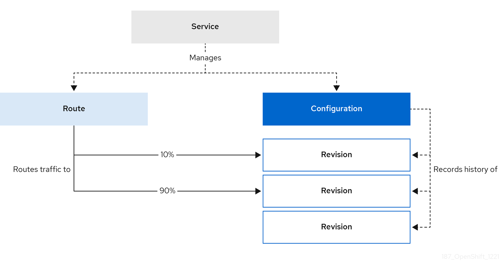

# Red Hat OpenShift Serverless Serving Demo

WIP!

Demoing Red Hat's OpenShift Serverless/Knative Serving power. I'm using a simple web app written in Python. In order to demonstrate e.g. traffic splitting functionalities, the displayed text of the web app (default is `Hello World!`) can be changed using environment variables like e.g. `--env MESSAGE='Who is it?'`.

## Build the Demo Application

You can build the application on your own using e.g. [Podman](https://podman.io/). Follow the provided steps:

Clone the Github repository:

`git clone git@github.com:rguske/openshift-serverless-demo.git`

Navigate into the folder (`cd demo-app`) and start buidling the app from scratch.

`podman build -t simple-serverless-app:1.0 -f demo-app/Containerfile`

Check the build:

```code
podman images

REPOSITORY                TAG         IMAGE ID      CREATED             SIZE
localhost/simple-web-app  1.0         8769fca45f40  About a minute ago  168 MB
docker.io/library/python  3.9-slim    95eddd44d6c4  6 days ago          155 MB
```

Run the app locally to see if it works or to apply your changes.

`podman run -d -p 8080:8080 -e MESSAGE="Who is it?" localhost/simple-serverless-app:1.0`

## Run the app as a Kubernetes deployment on OpenShift

Adjust the variables for your namespace and for the text accordingly:

```bash
export NS=rguske-functions
export MESSAGE='HI THERE'
```

Now, by copy and pasting the following, a Pod, a Service (`type: ClusterIP`) and a Route will be created.

```yaml
oc create -n ${NS} -f - <<EOF
kind: Pod
apiVersion: v1
metadata:
  name: simple-app
  labels:
    app: simple-app
    openshift.io/scc: restricted-v2
spec:
  containers:
  - name: simple-app
    image: docker.io/rguske/simple-serverless-app:1.0
    env:
    - name: MESSAGE
      value: ${MESSAGE}
    ports:
    - containerPort: 8080
---
apiVersion: v1
kind: Service
metadata:
  labels:
    app: simple-app
  name: simple-app-svc
spec:
  ports:
  - port: 8080
    protocol: TCP
  selector:
    app: simple-app
  type: ClusterIP
---
kind: Route
apiVersion: route.openshift.io/v1
metadata:
  name: simple-app-route
spec:
  host: simple-app-route-${NS}.apps.isar.coe.muc.redhat.com
  path: /
  to:
    kind: Service
    name: simple-app-svc
    weight: 100
  port:
    targetPort: 8080
  tls:
    termination: edge
    insecureEdgeTerminationPolicy: Redirect
EOF
```

## Knative Serving

Knative Serving is the runtime component of the Knative project. At its core, Knative Serving provides a Kubernetes-native platform to deploy, run, and manage modern `HTTP` workloads. In the context of Knative, serverless implies Knative's ability to abstracts away much of the underlying infrastructure complexity, allowing relevant teams to focus on writing code and defining the desired state of their  applications.

Key capabilities of Serving are:

- Serverless experience for `HTTP` workloads
- Scale-to-zero, request-driven compute runtime
- Point-in-time snapshot of your code and configuration (`Revision`)
- Traffic routing amongst `revisions`
- Supports deployment patterns like Blue/Green, Canary and Progressive
- Automatic DNS and TLS handling

### Deploy the Demo App as `ksvc`

`oc project rguske-serverless`

`kn service create simple-serverless-app --image quay.io/rguske/simple-serverless-app:1.0`

`watch -n 1 curl -s https://simple-serverless-app-rguske-serverless.apps.isar.coe.muc.redhat.com`

`kn service update simple-serverless-app --concurrency-limit=1`

`oc run -i --tty load-generator --rm --image=busybox:latest --restart=Never -- /bin/sh -c "while sleep 0.01; do wget -q -O- https://simple-serverless-app-rguske-serverless.apps.isar.coe.muc.redhat.com; done"`

### Revisons

`kn service update simple-serverless-app --revision-name v1 --env MESSAGE='Who is it?' --concurrency-limit=0`

`kn service update simple-serverless-app --revision-name v2 --env MESSAGE='Its me!'`

`kn service update simple-serverless-app --revision-name v3 --env MESSAGE='Sorry?'`

### Traffic Splitting

`kn service update simple-serverless-app --traffic simple-serverless-app-v1=33,simple-serverless-app-v2=33,simple-serverless-app-v3=34`

`watch -n 1 curl -s https://simple-serverless-app-rguske-serverless.apps.isar.coe.muc.redhat.com`



### Ingress Controller(s)

### Kourier

Kourier is the default ingress solution for OpenShift Serverless. It has the following properties:

- It is based on envoy proxy.
- It is simple and lightweight.
- It provides the basic routing functionality that Serverless needs to provide its set of features.
- It supports basic observability and metrics.
- It supports basic TLS termination of Knative Service routing.
- It provides only limited configuration and extension options.

### Custom Domains

Configuring a custom domain for a Knative service
Knative services are automatically assigned a default domain name based on your cluster configuration. For example, `<service_name>-<namespace>.example.com`. You can customize the domain for your Knative service by mapping a custom domain name that you own to a Knative service.

You can do this by creating a DomainMapping resource for the service. You can also create multiple DomainMapping resources to map multiple domains and subdomains to a single service.